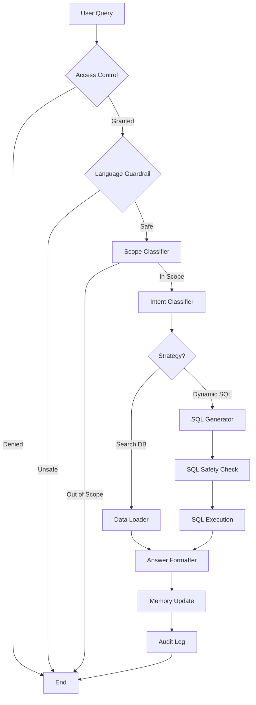
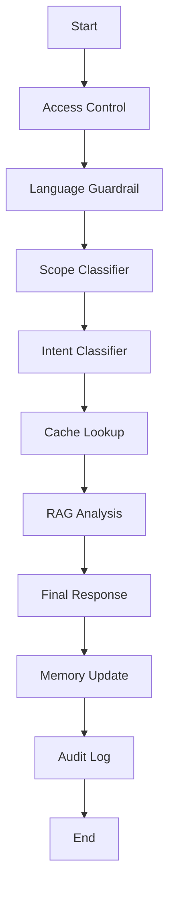

# VNR-ACE Project Documentation

## Overview
VNR-ACE (Advanced Campus Ecosystem) is a sophisticated campus management and student empowerment platform. It leverages a multi-agent architecture powered by **LangGraph** and **Gemini/Groq LLMs** to automate complex academic and career workflows.

---

## Technical Stack
- **Backend**: FastAPI (Python 3.11+)
- **Database**: PostgreSQL (via Supabase) with SQLAlchemy (Async)
- **Agent Framework**: LangGraph (Stateful, Orchestrated Agents)
- **LLMs**: Google Gemini (primary with rotation) & Groq (fallback)
- **PDF Engine**: ReportLab (for ATS-friendly resume generation)
- **Storage**: Supabase Storage (for documents and resumes)
- **Authentication**: JWT with Argon2 Password Hashing

---

## Agent Architecture
The system uses a **Stateful Agent** pattern where each agent is a compiled LangGraph with distinct nodes for Guardrails, Intent Classification, Data Retrieval, and Response Generation.

### 1. Admissions Agent Suite
- **Type**: Hierarchical Supervisor Agent
- **Description**: Handles prospective student and parent inquiries about departments, fees, and campus life.
- **Key Modules**:
  - **Supervisor**: Routes queries between FAQ and Departmental experts.
  - **Department Router**: Dynamically maps queries to specific department agents (CSE, ECE, etc.) based on fuzzy matching.
  - **FAQ Agent**: Uses a specialized knowledge base for common institutional questions.
- **Graph Structure**: Supervisor -> [FAQ | Department Router -> Dept-Specific Nodes]

### 2. Placements Agent Suite
- **Type**: Multi-Specialist Agents
- **Description**: Managed the end-to-end placement journey for students.
- **Key Agents**:
  - **Resume Feedback Agent**: Performs RAG-based analysis on student resumes against ATS standards.
  - **Resume Editor Agent**: Allows interactive, section-wise editing of resumes with LLM suggestions.
  - **Interview Prep Agent**: Generates tailored interview questions based on job descriptions and student profiles.
  - **Shortlisting Agent**: Uses RAG to match student profiles with specific job requirements for TPO use.

### 3. Classwork & Faculty Agent Suite
- **Type**: Data-Retrieval & Automation Agents
- **Description**: Assists faculty and students with administrative and academic tasks.
- **Key Agents**:
  - **Faculty Timetable Enquiry Agent**: (ReAct Pattern) Converts natural language into SQL to query faculty schedules, venues, and availability.
  - **Report Generation Agent**: (Human-in-the-Loop) Aggregates data from multiple tables to generate complex reports (e.g., Defaulter Lists) with an approval workflow.
  - **Email Automation Agent**: Drafts and sends broadcast emails for academic updates, requiring human verification.

---

## Key Technical Features

### Multi-Agent Workflows (Mermaid Diagrams)

#### Faculty Timetable Enquiry Flow


#### Resume Feedback Workflow


### LLM Key Rotation System
Located in `core/llm.py`, the `RotatedGeminiLLM` ensures high availability by:
- Monitoring rate limits (429 errors).
- Automatically switching between a pool of API keys.
- Falling back to **Groq (Llama 3)** if the entire Gemini pool is exhausted.

### Guardrails & Security
Every agent interaction passes through:
1. **Access Control**: Validates user roles (Student, Faculty, Admin).
2. **Language Guardrail**: Detects prompt injection, toxic language, and jailbreak attempts.
3. **SQL Safety**: For agents generating SQL, a strict keyword whitelist and forbidden pattern check (no DROP, DELETE, etc.) are applied before execution.

---

## Project Structure
```text
vnr-ace-backend/
├── agents/             # LangGraph Agent Implementations
│   ├── admissions/     # Public/Admission Inquiries
│   ├── classwork/      # Academic & Faculty Tools
│   ├── placements/     # Career & Resume Tools
│   └── core_modules.py # Shared Agent Services (SQL, LLM, Audit)
├── core/               # Shared Utilities (DB, Auth, LLM Config)
├── models/             # SQLAlchemy Database Models
├── routes/             # FastAPI Endpoint Definitions
├── scripts/            # Data Ingestion & Migration Tools
└── utils/              # Helper modules (PDF, Storage, Mail)
```
